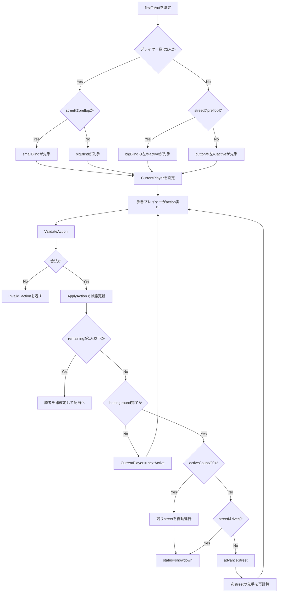
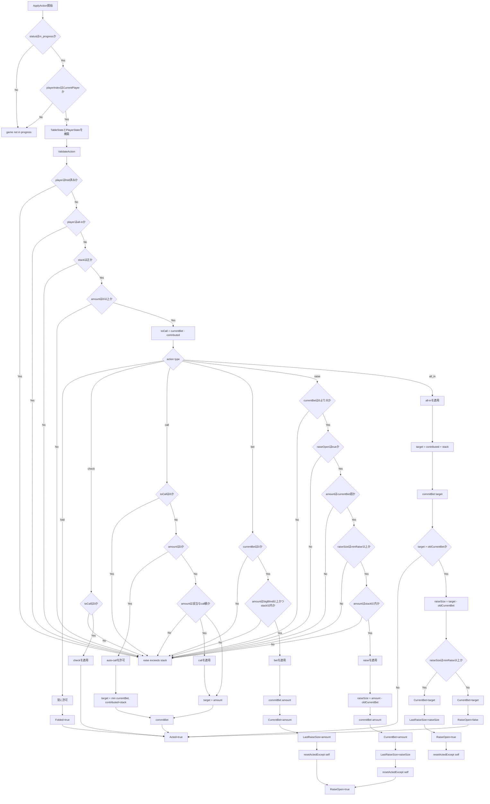
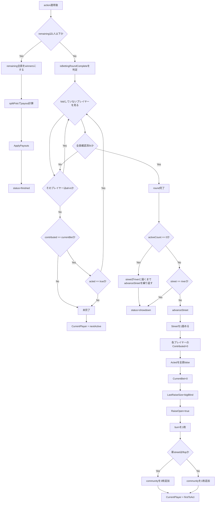
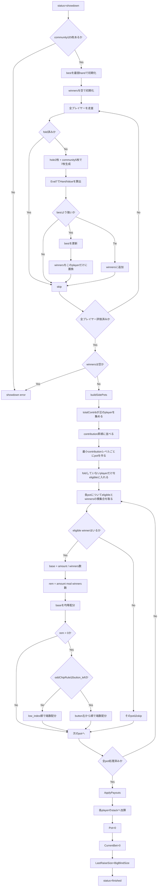

# ゲームフロー

この文書は、Go 版の `internal/core/game/game.go` と `showdown.go` を基に、`mapoker` の 1 hand の進行を `mermaid` で可視化したものです。

## 見方

- `active` は `fold していない` かつ `all-in ではない` プレイヤーを指す
- `remaining` は `fold していない` プレイヤーを指す
- `contributed` はその street での投入額
- `totalContrib` はその hand 全体での投入額

## 1. ゲーム作成からハンド開始まで

```mermaid
graph TD
    A[CreateGame] --> B[入力検証]
    B --> C{playersは2から9人か}
    C -- No --> Z1[create error]
    C -- Yes --> D{bigBlindは正か}
    D -- No --> Z1
    D -- Yes --> E{buttonIndexは有効か}
    E -- No --> Z1
    E -- Yes --> F[GameState生成]

    F --> G[Deckを52枚生成]
    G --> H[seedありなら決定的シャッフル]
    H --> I[初期値を設定]
    I --> I1[street=preflop]
    I1 --> I2[status=in_progress]
    I2 --> I3[currentBet=0]
    I3 --> I4[lastRaiseSize=bigBlind]
    I4 --> I5[oddChipRule=low_index]
    I5 --> I6[raiseOpen=true]
    I6 --> J[Actedを全員falseで初期化]
    J --> K[storeへ保存]

    K --> L[StartHand]
    L --> M{statusがshowdownか}
    M -- Yes --> Z2[start error]
    M -- No --> N[hand状態をリセット]

    N --> N1[LastShowdown=nil]
    N1 --> N2[Communityを空にする]
    N2 --> N3[DeckPos=0]
    N3 --> N4[Pot=0]
    N4 --> N5[CurrentBet=0]
    N5 --> N6[LastRaiseSize=bigBlind]
    N6 --> N7[BigBlindSize=bigBlind]
    N7 --> N8[RaiseOpen=true]
    N8 --> N9[Street=preflop]

    N9 --> O[各プレイヤーを初期化]
    O --> O1[Folded=false]
    O1 --> O2[AllIn=false]
    O2 --> O3[Contributed=0]
    O3 --> O4[TotalContrib=0]
    O4 --> O5[Holeを空にする]

    O5 --> P[stackが0以下のプレイヤーはfold扱い]
    P --> Q{チップを持つプレイヤーが2人以上か}
    Q -- No --> Z2
    Q -- Yes --> R[SBを決定<br/>2人: button=SB<br/>3人以上: button左のactive]
    R --> S[BBを決定<br/>2人: もう1人<br/>3人以上: SB左のactive]
    S --> T[SBをpostBlind]
    T --> U[BBをpostBlind]
    U --> V[blindでstackが0になったらall-in]
    V --> W[activeプレイヤーへ2周してholeを2枚配る]
    W --> X[CurrentBet = BBのContributed]
    X --> Y[LastRaiseSize = bigBlind]
    Y --> Y1[Actedを全員falseへ]
    Y1 --> Y2[RaiseOpen=true]
    Y2 --> Z[CurrentPlayer = firstToAct]
    Z --> ZA[first betting roundへ]
```

## 2. 手番決定と betting round の大枠

## 3. action 検証と状態更新

## 4. betting round 完了判定と street 遷移

## 5. showdown と side pot 配当

